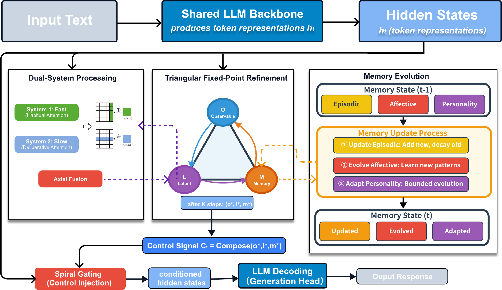

# BRIDGE

**Triangular Fixed-Point Refinement for Long-Horizon Persona Consistency**

[ICML 2026] · Yinghui Jiang, Bocheng Xu, Jianye Xie, Haotong Sun

> Reference implementation of BRIDGE — an architectural approach to
> *latent state drift* in long-horizon persona dialogue. Observable
> behaviors (O), Latent cognition (L), and Memory (M) are explicitly
> **coupled and refined to a fixed point** before each decode, then a
> tiered memory evolves with a Lyapunov-bounded update.

---

## TL;DR

| Component | Role | Section |
|---|---|---|
| **Triangular Fixed-Point Refinement** | Gauss–Seidel cycle M → O → L → M with pairwise cross-attention and provable contraction (Theorem 1). | §2.2 |
| **Dual-System Processing** | System-1 fast pathway over a learned habit (K,V) bank + System-2 D-layer deliberative stack; multiplicative context-aware gate fuses the two and injects into the frozen backbone. | §2.3 |
| **Hierarchical Memory Evolution** | Three tiers (episodic / affective / personality) with anchored clipped updates and a Lyapunov uniform drift bound (Theorem 2). | §2.4 |

**Headline results** (frozen Qwen2.5-32B-Instruct backbone, 277M trainable, 0.85% of total):

- **PersonaGym**: 4.59 PersonaScore — surpasses Claude-3.7-Sonnet (4.49) and every PEFT baseline on the same backbone.
- **CoSER**: 59.5% average — +3.1 over Claude-3.7-Sonnet, +8.0 Character Fidelity over Qwen2.5-32B-Instruct.
- **Asymmetric rupture risk**: 59% relative reduction in CF<35 ruptures (37% → 15%) on a stratified CoSER subset.
- **Latency**: ~16–18 ms TTFT overhead, approximately constant in context length — refinement runs on 1024-dim state vectors, not the token sequence.

Concurrent companion paper: [**KSKT**](https://github.com/Sunrich-HT/KSKT) — within-turn role–user conflict via dual-perspective factorized attention. KSKT targets intra-turn; BRIDGE targets cross-turn. The two compose naturally (KSKT can serve as the per-turn generator inside BRIDGE's session-level loop).

---

## Architecture

<p align="center">
  
</p>

Per dialogue turn, BRIDGE executes four stages (Algorithm 1 in the paper):

1. **State Initialization** — pool the frozen backbone hidden states into a seed latent; the fast and slow pathways produce `h^(1), h^(2)`, which are fused into `l^(0)`. The pooled state also seeds `o^(0)`. Working memory is carried from the previous turn.
2. **Triangular Fixed-Point Refinement** — `K` Gauss–Seidel iterations of the three pairwise edges; the contraction condition `‖A‖∞ < 1` guarantees a unique fixed point with geometric convergence.
3. **Control Injection & Decoding** — concatenate the refined `o^K, l^K, m^K` into the state-level control `C_t`, combine with the gated turn-level mixture `c_t`, project to the backbone hidden size, add to `H_t`, and decode via the frozen LM head.
4. **Hierarchical Memory Evolution** — apply the anchored clipped update to each tier with `η_e > η_a > η_p` and `δ_e > δ_a > δ_p`. The Lyapunov function `V(m_t) = Σ_i γ_i ‖m_t^(i) - m_0^(i)‖²` is uniformly bounded.

The corresponding Python is in [`bridge/modeling_bridge.py`](bridge/modeling_bridge.py) (Algorithm 1 driver) with components in [`bridge/triangular.py`](bridge/triangular.py), [`bridge/dual_system.py`](bridge/dual_system.py), and [`bridge/memory.py`](bridge/memory.py).

---

## Installation

```bash
git clone https://github.com/Sunrich-HT/BRIDGE.git
cd BRIDGE
pip install -e .
```

Tested with **Python 3.10+, PyTorch 2.1+, transformers 4.45+**.

---

## Quickstart (CPU smoke test)

```bash
python examples/quick_forward.py
```

This instantiates a tiny BRIDGE without a backbone, drives 6 turns, and
prints the refinement residual, contraction proxy, personality-drift
trajectory, and the Lyapunov energy ratio `V / V_max`.

---

## Training

Reproduces the recipe in Appendix Table 6: AdamW, lr `1e-5`, batch 32,
50K steps, λ₁=0.1, λ₂=0.5; the backbone stays frozen throughout.

```bash
export TRAIN_JSONL=data/persona_dialogues.jsonl
export BASE_MODEL=Qwen/Qwen2.5-32B-Instruct
export OUTPUT_DIR=runs/bridge_32b
bash scripts/train.sh
```

`TRAIN_JSONL` follows the schema in [`examples/sample_data.jsonl`](examples/sample_data.jsonl):

```json
{"persona": "<initial persona description>",
 "history": [{"speaker": "user", "text": "..."}, {"speaker": "assistant", "text": "..."}],
 "response": "<gold reply>",
 "negative_response": "<optional mined negative used by L_persona>"}
```

The paper uses RoleMRC + OpenCharacter as training corpora, with 10K
examples held out per source for validation.

---

## Evaluation

### PersonaGym (Table 1, single-turn)

```bash
CKPT=runs/bridge_32b/bridge_final.pt \
BENCH=data/personagym/test.jsonl \
bash scripts/eval_personagym.sh
```

### CoSER (Table 1, multi-turn)

```bash
CKPT=runs/bridge_32b/bridge_final.pt \
BENCH=data/coser/test.jsonl \
bash scripts/eval_coser.sh
```

CoSER is run turn-by-turn so the hierarchical memory genuinely evolves
across the conversation; the script also reports the CF<35 rupture rate
used in §3.4.

### Long-horizon stability (LoCoMo, Figure 4)

```bash
CKPT=runs/bridge_32b/bridge_final.pt \
BENCH=data/locomo/test.jsonl \
bash scripts/eval_locomo.sh
```

Reports `V(m_t)/V_max`, the contraction proxy `α̃`, and per-tier drift
trajectories over the requested horizon (default 500 turns).

### O–L specialization (Figure 5)

```bash
python -m bridge.evaluation.eval_ol_probing \
    --checkpoint runs/bridge_32b/bridge_final.pt \
    --probe_jsonl data/probes/ol_specialization.jsonl
```

Reports `cos(o, l)` and the diagonal-dominance pattern showing O
predicts behavioral attributes better and L predicts cognitive ones.

---

## File layout

```
BRIDGE/
├── configs/
│   └── bridge_32b.yaml                # Hyperparameters (Table 6)
├── bridge/
│   ├── config.py                      # BridgeConfig dataclass
│   ├── triangular.py                  # §2.2 Triangular Fixed-Point Refinement
│   ├── dual_system.py                 # §2.3 Dual-System Processing + injector
│   ├── memory.py                      # §2.4 Hierarchical memory evolution
│   ├── losses.py                      # Eq. 11: L_LM + λ₁·L_cycle + λ₂·L_persona
│   ├── modeling_bridge.py             # Algorithm 1 driver
│   ├── data/dataset.py                # PersonaDialogueDataset, collator
│   ├── training/
│   │   ├── trainer.py                 # SFT trainer with frozen backbone
│   │   └── train.py                   # CLI entry point
│   └── evaluation/
│       ├── eval_personagym.py         # Table 1 (single-turn)
│       ├── eval_coser.py              # Table 1 (multi-turn) + rupture audit
│       ├── eval_locomo_stability.py   # Figure 4 (Lyapunov diagnostics)
│       └── eval_ol_probing.py         # Figure 5 (O/L specialization)
├── scripts/
│   ├── train.sh
│   ├── eval_personagym.sh
│   ├── eval_coser.sh
│   └── eval_locomo.sh
├── examples/
│   ├── quick_forward.py               # CPU smoke test
│   └── sample_data.jsonl
├── requirements.txt
├── setup.py
└── LICENSE                            # Apache-2.0
```

---

## Reproducing main numbers (paper Tables 1, 4)

| Method (Qwen2.5-32B-Instruct backbone) | PersonaGym Avg | CoSER Avg | CoSER CF |
|---|---|---|---|
| Qwen2.5-32B-Instruct (zero-shot)   | 4.31 | 53.4 | 40.2 |
| + CoT                              | 4.37 | 54.7 | 41.8 |
| LoRA (r=64)                        | 4.42 | 55.7 | 43.8 |
| Neeko (Dynamic LoRA)               | 4.44 | 56.5 | 45.5 |
| **BRIDGE (Ours)**                  | **4.59** | **59.5** | **48.2** |

Component ablations (paper Table 2): removing **personality memory** causes the largest drop on CoSER (−6.1); replacing **Triangular Fixed-Point Refinement** with standard attention is the largest single-component drop overall (−0.19 PersonaGym, −4.9 CoSER), validating the closed-loop reconciliation hypothesis.

The triangular refinement adds roughly `K × 6 ms` per turn on A100 (Appendix B.5); `K=1` already exceeds the best PEFT baseline (4.55 vs. 4.44 on PersonaGym), giving a deployment-time latency–quality knob.

---

## Citation

```bibtex
@inproceedings{jiang2026bridge,
  title     = {BRIDGE: Triangular Fixed-Point Refinement for Long-Horizon Persona Consistency},
  author    = {Jiang, Yinghui and Xu, Bocheng and Xie, Jianye and Sun, Haotong},
  booktitle = {Proceedings of the International Conference on Machine Learning (ICML)},
  year      = {2026},
}
```

Companion work (within-turn role–user conflict):

```bibtex
@inproceedings{sun2026kskt,
  title     = {Know Thyself, Know Thy User: Intrinsic Dual-Perspective Reasoning for Role-Playing LLMs},
  author    = {Sun, Haotong and Xie, Jianye and Xu, Bocheng and Jiang, Yinghui},
  booktitle = {Proceedings of the International Conference on Machine Learning (ICML)},
  year      = {2026},
}
```

---

## License

Apache-2.0. See [LICENSE](LICENSE).
